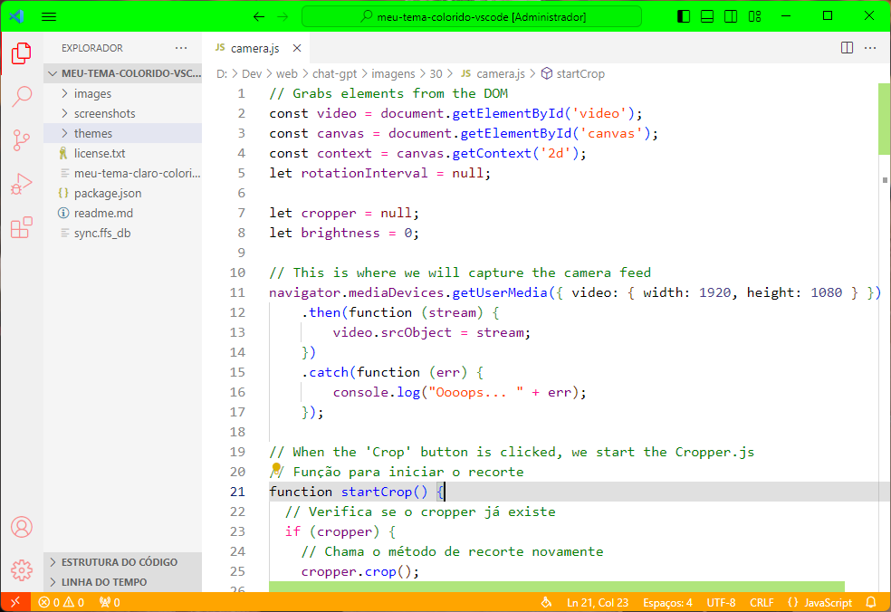
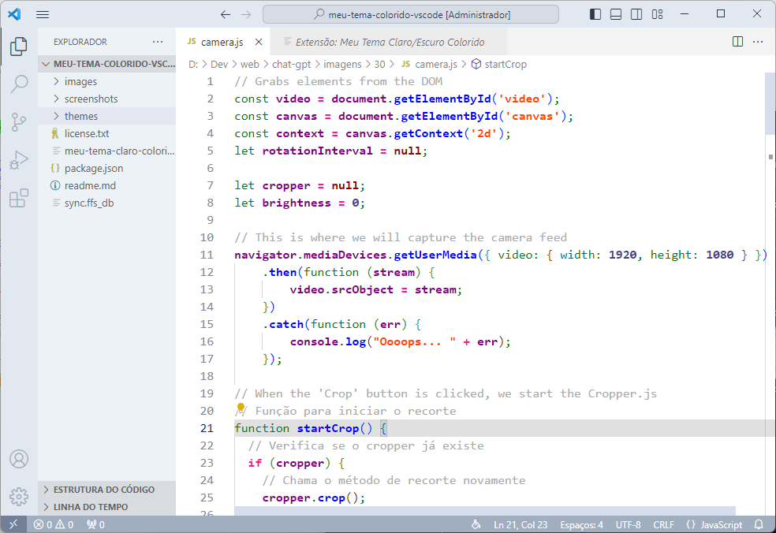
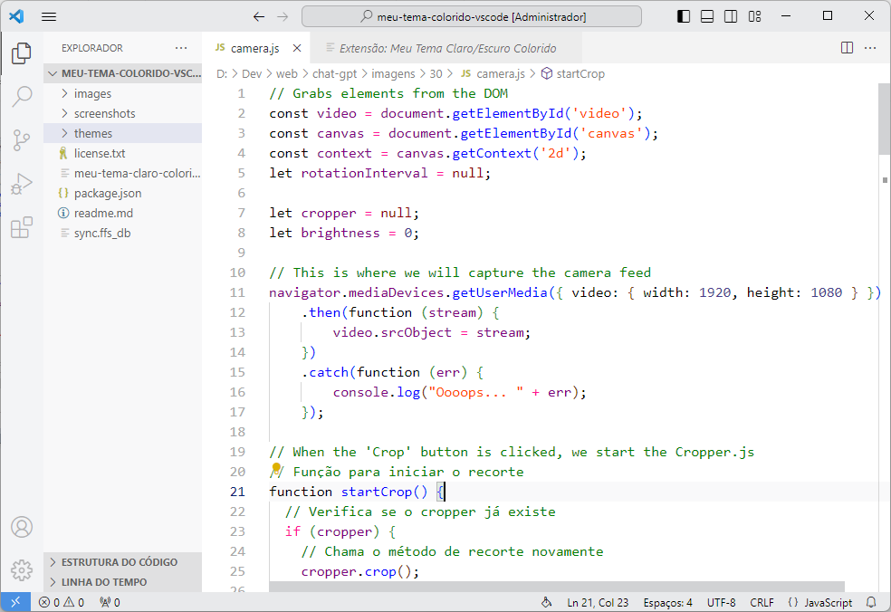
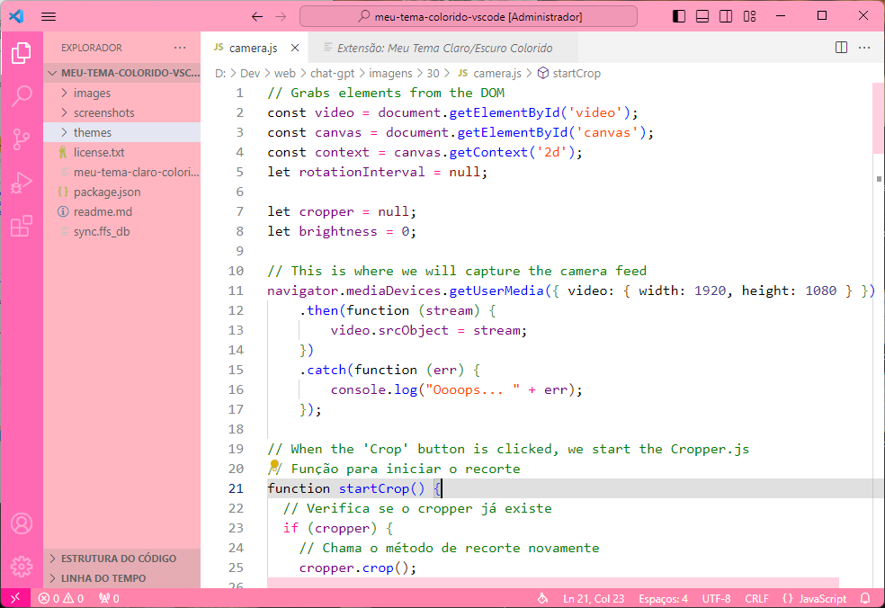
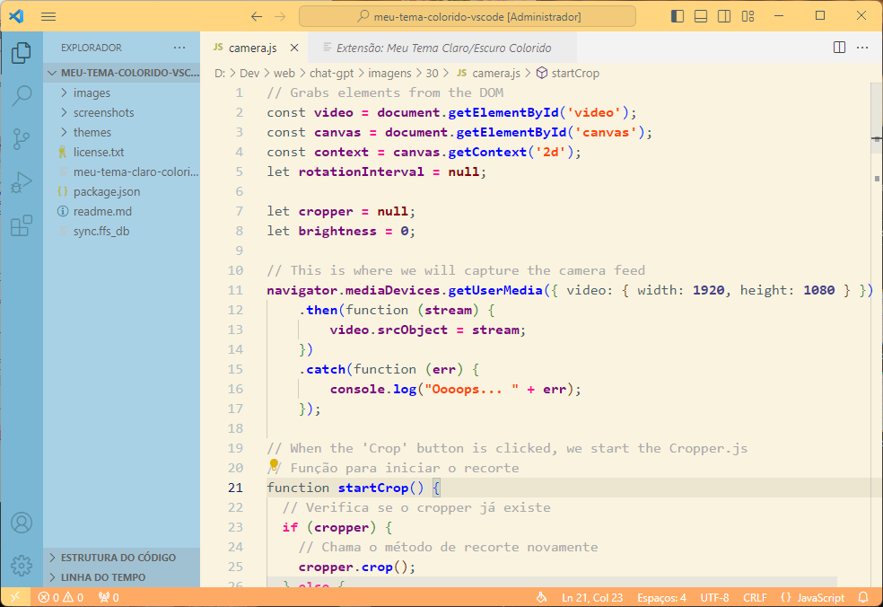
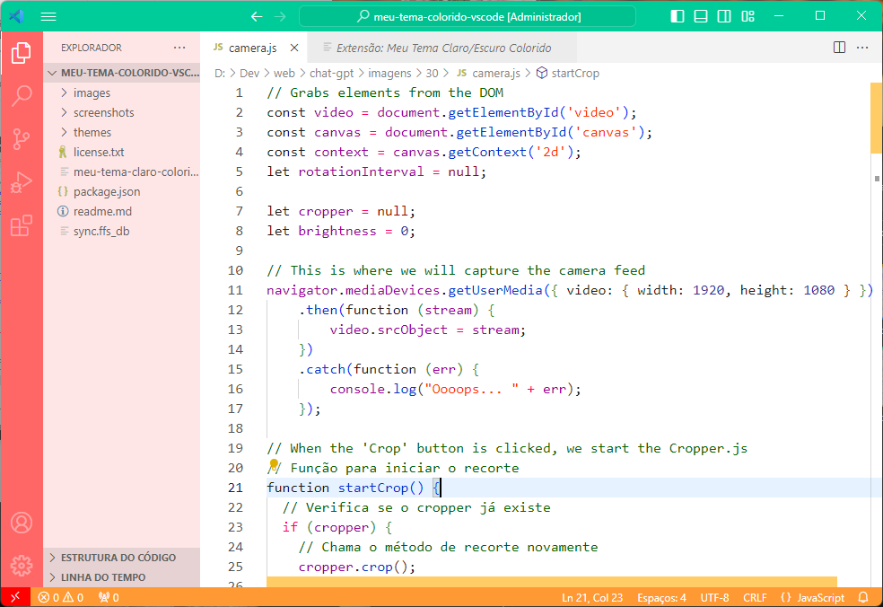
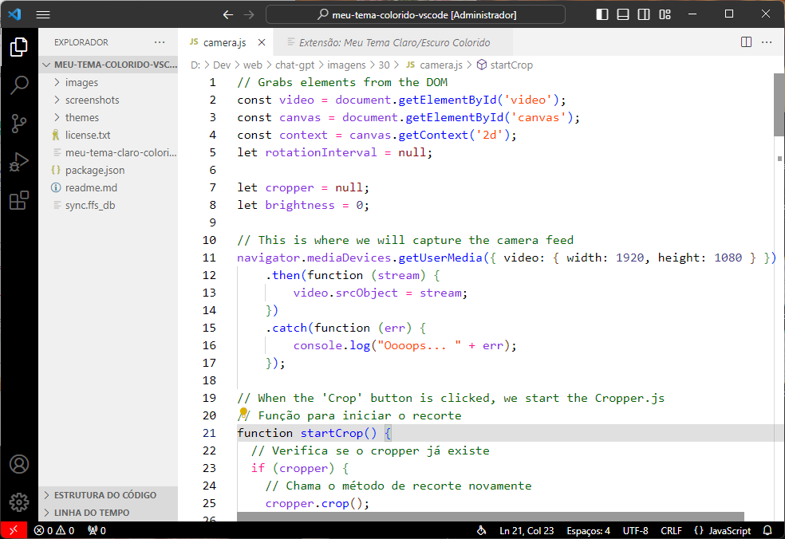
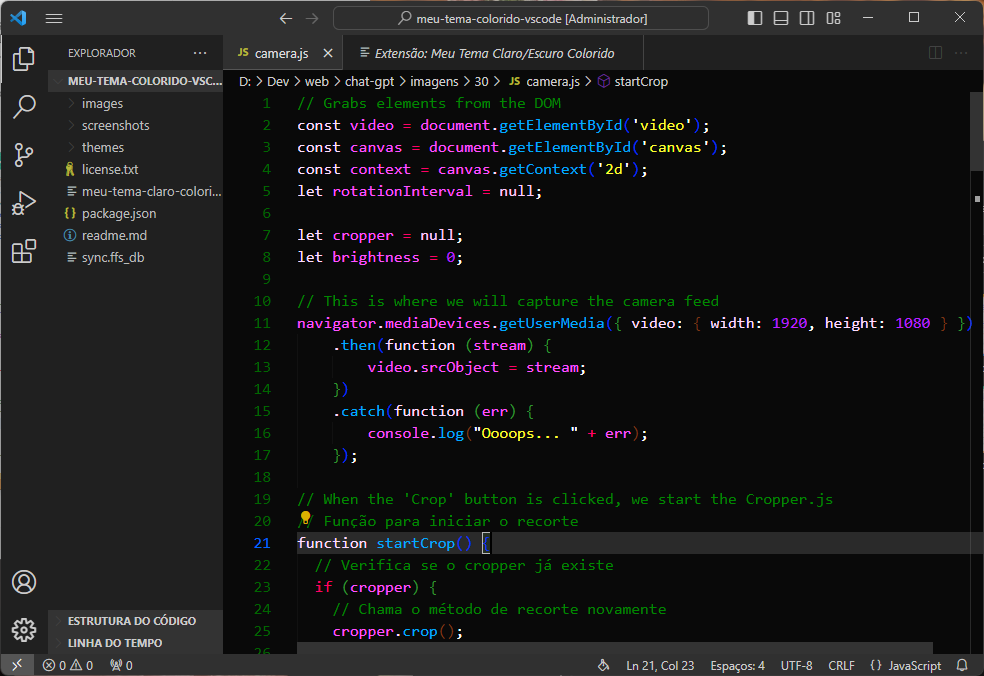
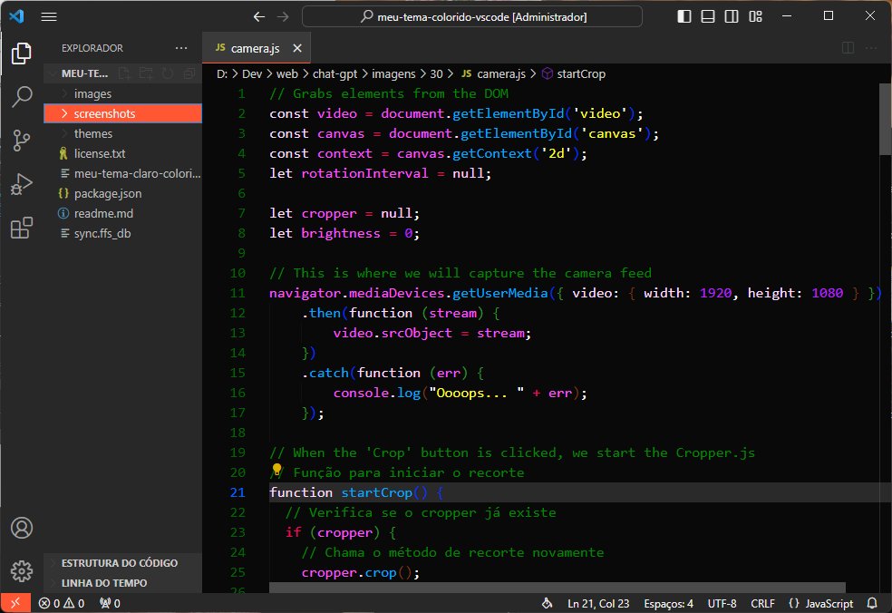
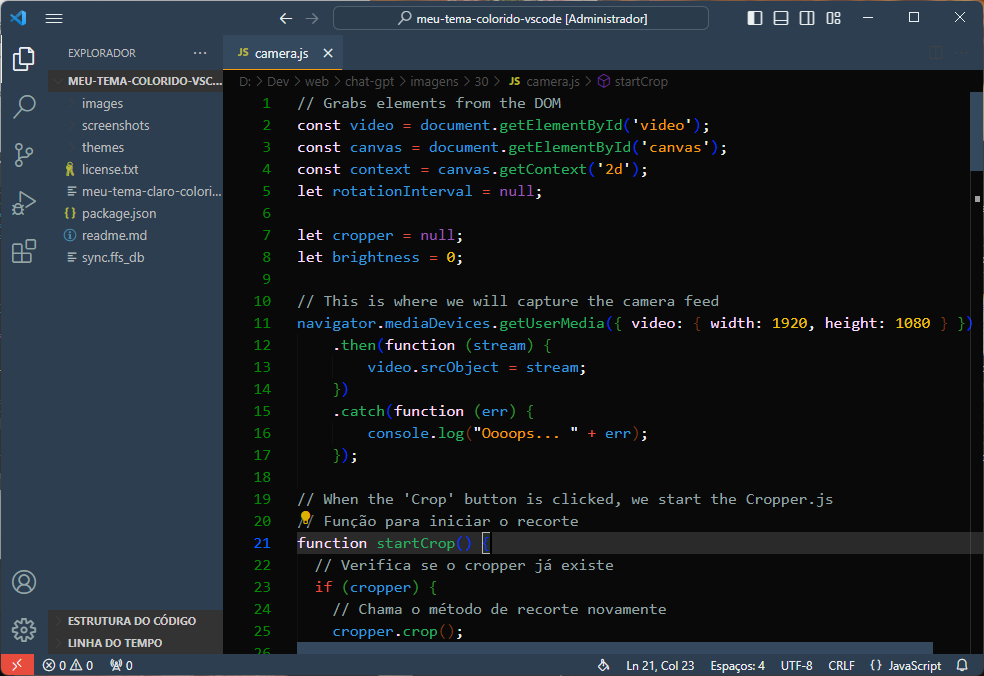

# 🌈 Meu Tema Claro Colorido para VSCode 
### **Agora com temas escuros disponíveis** 🎨

**Ei, amante de cores!** 🌟 Prepare-se para iluminar seu VSCode com este tema espetacular!

---
## 📅 Atualizações Recentes

- **12/10/2023** - 🎉 Adicionados tema de festa, em comemoração aos **100 downloads** em menos de 1 mês, e criado tema Pink.
- **10/10/2023** - Adicionados tema de praia / Corrigidos alguns bugs em temas escuros.
- **08/10/2023** - Ajustes nas cores do editor e comentários dos temas em negrito.
- **07/10/2023** - Adicionada opção de negrito em alguns temas.

## 🎨 22 Opções de Cores Disponíveis

- 🌟 Meu Tema Claro Colorido Original (Normal e Negrito)
- 🎉 Meu Tema Claro Colorido Vibrante (Normal e Negrito)
- 🌆 Meu Tema Claro Colorido Contemporâneo (Normal e Negrito)
- 🕰️ Meu Tema Claro Colorido Clássico (Normal e Negrito)
- 🎊 Meu Tema Claro Colorido Festa (Normal e Negrito)
- 🎀 Meu Tema Claro Colorido Pink (Normal e Negrito)
- 🔍 Meu Tema Claro Colorido Alto Contraste
- 😈 Meu Tema Claro Colorido Mais Mal que o Capiroto
- 🏝️ Meu Tema Claro Praiano (Normal e Negrito)
- 🌝 Meu Tema Claro Super Alegre (Normal e Negrito)
- 🌆 Meu Tema Escuro Colorido Contemporâneo
- 🕰️ Meu Tema Escuro Colorido Clássico
- 🌚 Meu Tema Escuro Original
- 🤖 Meu Tema Escuro Colorido Escolhido pelo Chat GPT

🌚 **Por que adicionamos temas escuros?** ~~Porque mesmo amantes de cores precisam de uma pausa para seus olhos~~. **Apenas para nos lembrar do quanto amamos os temas claros!** 🌝

---

## 📸 Screenshots

## 🚀 Instalação

💡 **Instalar este tema é moleza!** Procure por "Meu Tema Claro Colorido" no marketplace do VSCode e clique em instalar. Ou, se você é do tipo que gosta de atalhos, [clique aqui para acessar diretamente no marketplace](https://marketplace.visualstudio.com/items?itemName=Kureke.meu-tema-claro-colorido).

---

## 🤝 Contribuindo

💬 **Adoramos feedback!** Se você encontrar algum problema ou tiver alguma sugestão de melhoria, por favor, crie uma issue ou pull request no [repositório do GitHub](https://github.com/Kureke/vscode-meu-tema-claro-colorido). Juntos, faremos deste tema o melhor de todos!

---