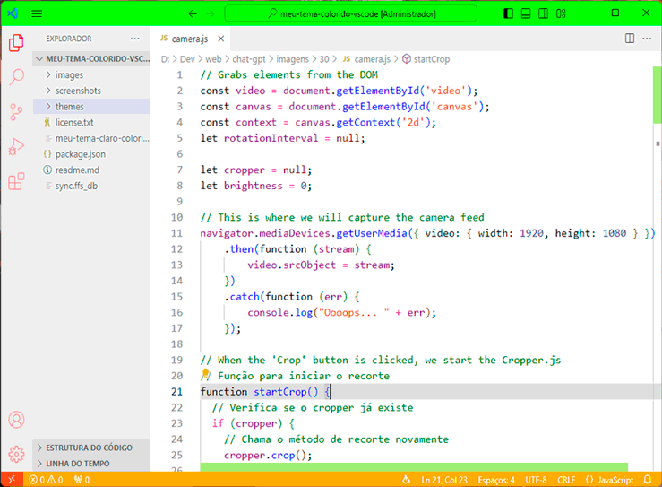

# 🌈 Meu Tema Claro Colorido para VSCode
(Agora com mais opções que sabores de sorvete)

**E aí, campeão de escolhas de cores!** 🎨 Se prepara, porque você vai embarcar numa aventura visual que promete deixar seu código mais colorido que parada de 7 de Setembro!

🌚 **Por que temas escuros, você pergunta?** Para descansar os olhos? Nah. **É pra gente dar mais valor aos momentos de luz, tipo aquela pausa para o café que na verdade é um descanso pra vista.** 🌝

---

## 🎨 51 Opções de Temas - Porque escolher é viver!

- 🌟 **[(Claro) Original](#)** - A base de tudo. Puro como água mineral.
- 🎉 **[(Claro) Vibrante](#)** - Tão animado que quase sai dançando.
- 🌆 **[(Claro) Contemporâneo](#)** - Para os moderninhos de plantão.
- 🕰️ **[(Claro) Clássico](#)** - Nostalgia pura, como brincar de Atari.
- 👔 **[(Claro) Elegante Cinza](#)** - A cor do cérebro em funcionamento.
- 👔 **[(Claro) Elegante Azul](#)** - Como o céu em um dia perfeito de programar.
- 💎 **[(Claro) Deserto Misterioso](#)** - O mistério do código, agora em areia.
- 🎊 **[(Claro) Festa](#)** - Porque programar também é uma celebração.
- 🎄 **[(Claro) Natal](#)** - Ho ho ho, bugs fora!
- 💍 **[(Claro) de Casamento](#)** - Compromisso sério com o código.
- 💕 **[(Claro) da Noiva](#)** - Para codar pensando no grande dia.
- 🎀 **[(Claro) Pink](#)** - Barbie programmer vibes.
- 🔍 **[(Claro) Alto Contraste](#)** - Para os que gostam de tudo bem marcado.
- 😈 **[(Claro) Mais Mal que o Capiroto](#)** - Para codar aprontando.
- 🏝️ **[(Claro) Praiano](#)** - Sinta a brisa do mar no seu editor.
- ☔ **[(Claro) Um Dia de Chuva](#)** - Calma e foco para dias introspectivos.
- 🌞 **[(Claro) Um Dia Quente de Verão](#)** - Traga o sol para dentro do escritório.
- 🌸 **[(Claro) Um Dia Florido de Primavera](#)** - Renovação e alegria primaveril.
- ❄️ **[(Claro) Um Dia de Inverno](#)** - Tons frios para refrescar a tela.
- 🌝 **[(Claro) Super Alegre](#)** - Um sorriso em cada caractere.
- 🤖 **[(Claro) Escolhido pelo Chat GPT](#)** - A inteligência artificial também tem bom gosto.
- 🧙‍♂️ **[(Escuro) Original](#)** - A noite é mais escura antes do amanhecer... e do seu código brilhar.
- 🎩 **[(Escuro) Clássico](#)** - Elegância noturna, sem olheiras.
- 🚀 **[(Escuro) Contemporâneo](#)** - O futuro é agora, e é escuro.
- 🍹 **[(Escuro) Bebedeira](#)** - Para os códigos que fluem melhor com um drink.
- 🕺 **[(Escuro) Festa](#)** - A noite toda codificando, como se não houvesse segunda-feira.
- 🤖 **[(Escuro) Escolhido pelo Chat GPT](#)** - Porque a IA também curte a noite.

- ...e sim, tem mais!

---

## 📸 Galeria de Screenshots

Mergulhe numa viagem visual através de nossos temas incríveis! Aqui estão alguns para você se perder:

...e muito mais para explorar!

---

## 📅 Novidades Fresquinhas

- **14/02/2024** - 🎉 Temas de carnaval para festar o code e café para acelerar!
- **14/12/2023** - 🎉 4 novos temas para desbancar os fogos de ano novo!
- **27/10/2023** - 🚀 Mais 6 temas porque a gente não sabe parar.
- **24/10/2023** - 🌚 A escuridão chegou e trouxe amigos.
- **17/10/2023** - 💍 Romantismo no ar, e no editor.
- **16/10/2023** - 🌦️ Inspirado pela mãe natureza e suas estações.

---

## 🚀 Instalação

💡 É mais fácil que escolher roupa pra sair! Procure por "Meu Tema Claro Colorido" no marketplace do VSCode ou [clique aqui e magicamente será levado para lá](https://marketplace.visualstudio.com/items?itemName=Kureke.meu-tema-claro-colorido).

---

## 🤝 Contribua com o Meu Tema Claro Colorido!

💬 Adoramos ouvir você! Encontrou um bug ou tem uma ideia? Venha compartilhar conosco no [GitHub](https://github.com/Kureke/vscode-meu-tema-claro-colorido). Vamos juntos fazer deste tema o mais brilhante do universo da programação!

---

