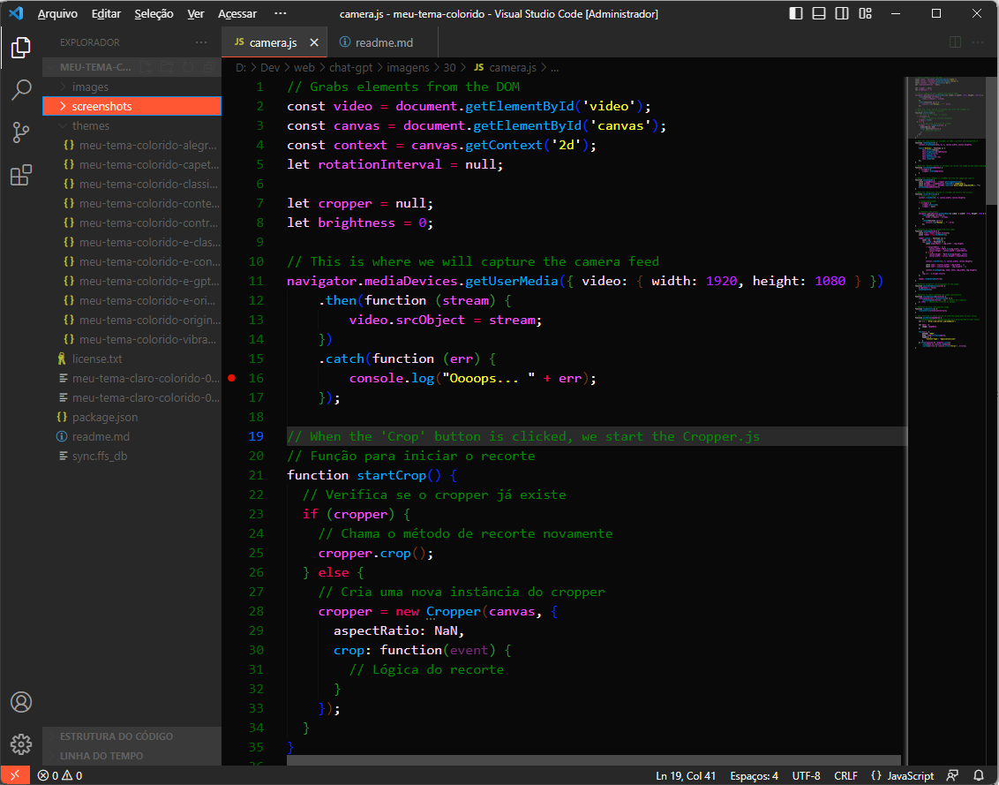
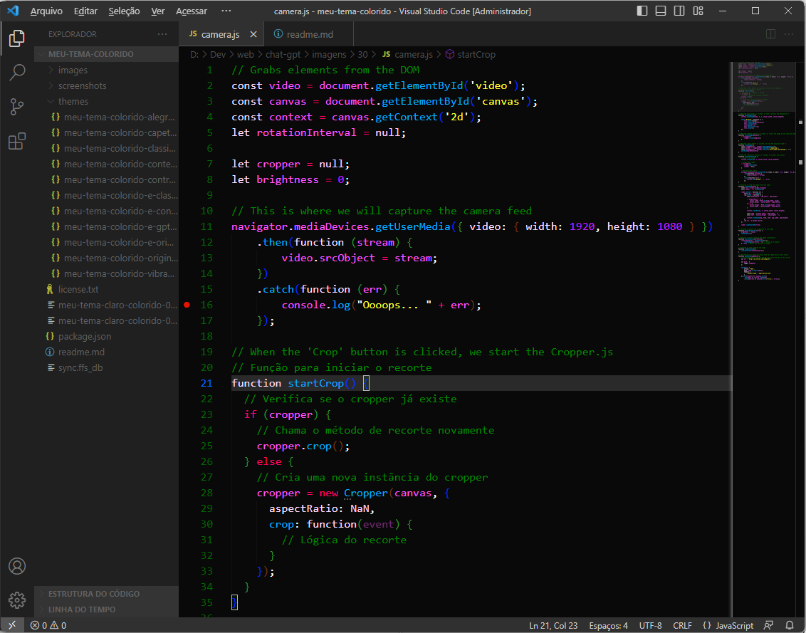
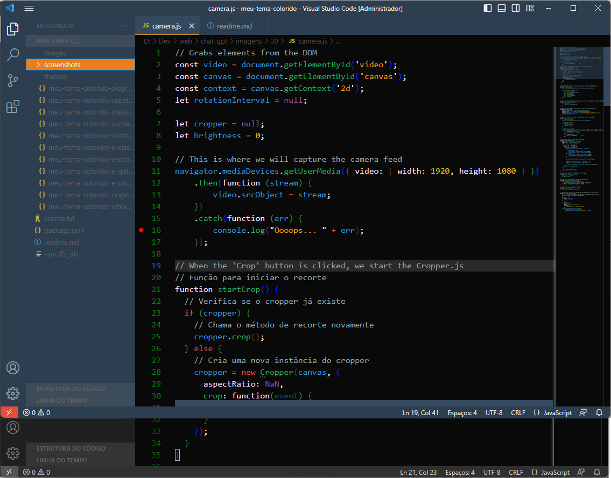

# 🌈 Meu Tema Claro Colorido para VSCode (agora com temas escuros, e opções de negrito disponíveis🎨)

**Ei, amante de cores!** Prepare-se para iluminar seu VSCode com este tema espetacular!

## 📅 Atualizações Recentes

- **07/10/2023** - Adicionada opção de negrito em alguns temas.

## 🎨 Temas Disponíveis

### 🌟 Meu Tema Claro Colorido Original

- **Normal**: Mergulhe na simplicidade com esta representação minimalista e original do Visual Studio Code em cores claras. Menos é mais!
- **Negrito**: Dê ênfase ao seu código com a versão em negrito deste tema clássico!

### 🎉 Meu Tema Claro Colorido Vibrante

Deixe seu código brilhar com esta paleta vibrante que destaca os principais elementos do editor. Porque seu código merece uma festa!

### 🌆 Meu Tema Claro Colorido Contemporâneo

- **Normal**: Mergulhe em um design moderno com cores suaves e tons equilibrados. É como um pôr do sol para o seu código!
- **Negrito**: Acentue as nuances modernas com a versão em negrito deste tema!

### 🕰️ Meu Tema Claro Colorido Clássico

- **Normal**: Viaje no tempo com um retorno às cores clássicas do passado, mas com um toque moderno. Nostalgia em cada linha de código!
- **Negrito**: Reviva o passado com mais destaque usando a versão em negrito deste tema clássico!

### 🌆 Meu Tema Escuro Colorido Contemporâneo

Mergulhe em um design moderno com cores suaves e tons equilibrados. É como um anoitecer para o seu código!

### 🕰️ Meu Tema Escuro Colorido Clássico

Reviva a era clássica da programação com este tema que combina o melhor do passado com o presente. É como programar em um museu!

### 🌚 Meu Tema Escuro Original

Quem disse que a escuridão não pode ser colorida? Experimente esta representação vibrante e original do Visual Studio Code em tema escuro. É uma festa noturna para seus olhos!

### 🤖 Meu Tema Escuro Colorido Escolhido pelo Chat GPT

Criado com a ajuda da inteligência artificial, este tema foi meticulosamente planejado para oferecer uma experiência de codificação única e eficiente. O futuro é agora!

### 🔍 Meu Tema Claro Colorido Alto Contraste

Dê um descanso aos seus olhos! Maximizando a legibilidade com contrastes altos e cores distintas. Porque seu código merece destaque!

### 😈 Meu Tema Claro Colorido Mais Mal que o Capiroto

Para quem quer se divertir (ou assustar colegas) com cores totalmente descoordenadas! Desafie seus olhos e seu senso de estilo!

## 🚀 Instalação

Instalar este tema é moleza! Procure por "Meu Tema Claro Colorido" no marketplace do VSCode e clique em instalar. Ou, se você é do tipo que gosta de atalhos, [clique aqui para acessar diretamente no marketplace](https://marketplace.visualstudio.com/items?itemName=Kureke.meu-tema-claro-colorido).

## 🤝 Contribuindo

Adoramos feedback! Se você encontrar algum problema ou tiver alguma sugestão de melhoria, por favor, crie uma issue ou pull request no [repositório do GitHub](https://github.com/Kureke/vscode-meu-tema-claro-colorido). Juntos, faremos deste tema o melhor de todos!
