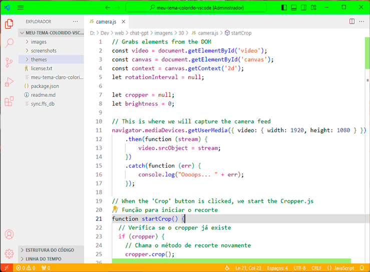
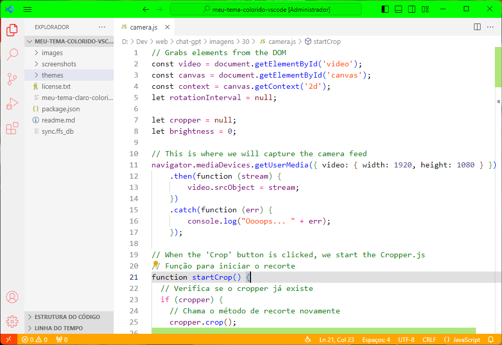
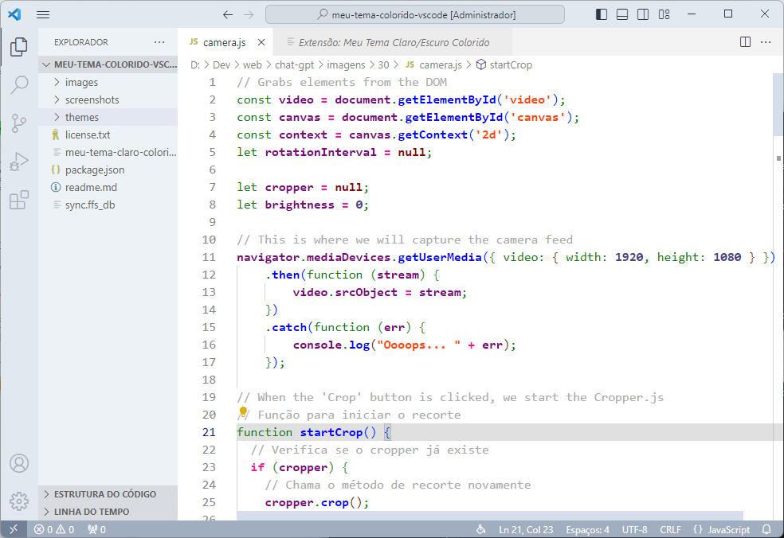
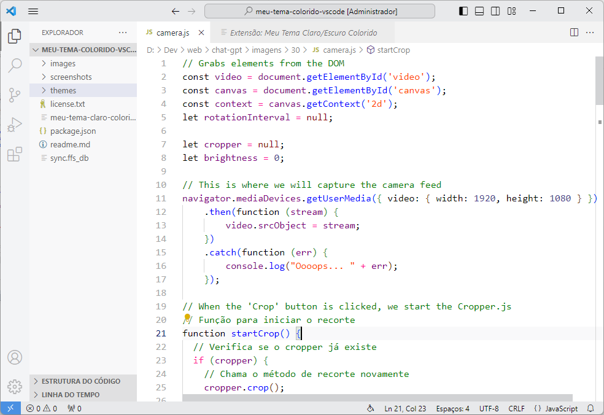
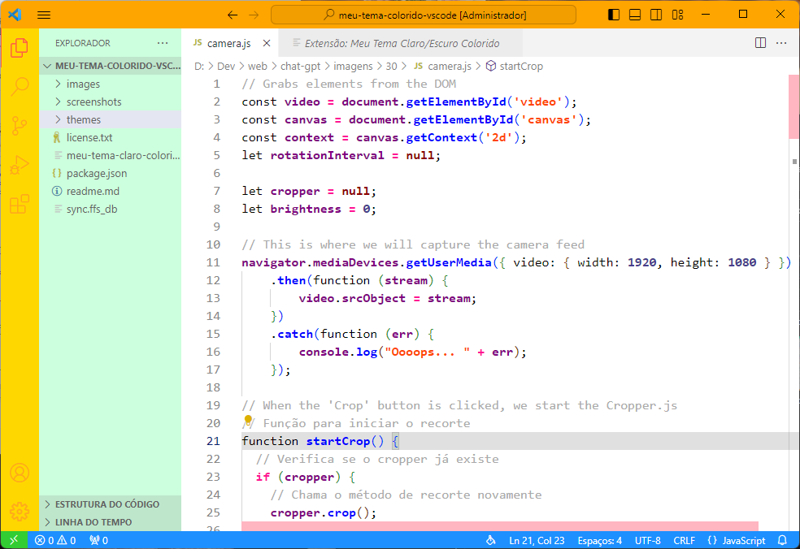

# 🌈 Meu Tema Claro Colorido para VSCode  
_(Agora com mais opções que sabores de sorvete 🍦)_

**E aí, campeão das cores!** 🎨  
Prepare-se para uma jornada visual que vai deixar seu código mais colorido que arco-íris em modo turbo!

🌚 Por que usar temas claros?  
Porque a luz também merece protagonismo. E convenhamos… aquela pausa estratégica para o café é só uma desculpa elegante para descansar os olhos. 🌝

---

## 🎨 81 Opções de Temas — Porque escolher é viver!

---

## 🌌 Destaque da Galáxia (novidade)

- 🚀 **(Claro) Galáxia Neon** — Energia cósmica em cada linha de código.
- 🌃 **(Claro) Galáxia Cyber** — Azul elétrico, ciano neon e atmosfera futurista no seu editor.

---

## 🎯 Recomendados pelo Criador

- 🇧🇷 **(Claro) Brasil** — Inspirado nas cores vibrantes do nosso país.
- 🌴 **(Claro) Caribe - San Andres** — Um toque tropical das águas cristalinas.
- 🌱 **(Claro) Menta** — Refrescante e suave como uma brisa leve.
- 🎀 **(Claro) Pink** — Barbie programmer vibes.
- 🌳 **(Claro) Floresta Amazônica** — Intenso e natural.

---

## 🌟 Clássicos da Coleção

- 🌟 **(Claro) Original** — A base de tudo.
- 🎉 **(Claro) Vibrante** — Tão animado que quase sai dançando.
- 🌆 **(Claro) Contemporâneo** — Moderno e equilibrado.
- 🕰️ **(Claro) Clássico** — Nostalgia pura.
- 👔 **(Claro) Elegante Cinza** — Foco total.
- 👔 **(Claro) Elegante Azul** — Como o céu em um dia perfeito para programar.
- 💎 **(Claro) Deserto Misterioso** — Mistério em tons de areia.
- 🎊 **(Claro) Festa** — Porque programar também é celebração.
- 🎄 **(Claro) Natal** — Ho ho ho, bugs fora!
- 💍 **(Claro) de Casamento** — Compromisso sério com o código.
- 💕 **(Claro) da Noiva** — Para codar pensando no grande dia.
- 🔍 **(Claro) Alto Contraste** — Para quem gosta de tudo bem destacado.
- 😈 **(Claro) Mais Mal que o Capiroto** — Totalmente fora da curva.
- 🏝️ **(Claro) Praiano** — Sinta a brisa do mar no seu editor.
- ☔ **(Claro) Um Dia de Chuva** — Calma e foco.
- 🌞 **(Claro) Um Dia Quente de Verão** — Sol dentro do escritório.
- 🌸 **(Claro) Um Dia Florido de Primavera** — Renovação e alegria.
- ❄️ **(Claro) Um Dia de Inverno** — Tons frios e elegantes.
- 🌝 **(Claro) Super Alegre** — Um sorriso em cada caractere.
- 🤖 **(Claro) Windows 98 e XP** — Revivendo o passado.
- 🤖 **(Claro) Escolhido pelo Chat GPT** — A IA também tem bom gosto.
- 9️⃣ **(Claro) Nine Labs** — Em agradecimento.

E sim… ainda tem mais 😉

---

## 🌙 Versões Escuras

- 🧙‍♂️ **(Escuro) Original**
- 🎩 **(Escuro) Clássico**
- 🚀 **(Escuro) Contemporâneo**
- 🍹 **(Escuro) Bebedeira**
- 🕺 **(Escuro) Festa**
- 🤖 **(Escuro) Escolhido pelo Chat GPT**

---

## 📸 Galeria

Mergulhe numa viagem visual pelos temas:

_E muitos outros esperando por você._

---

## 📅 Novidades

- **24/02/2026** — 🚀 Mais 4 temas da galáxia adicionados!
- **10/08/2024** — 🇻🇪 Tema de apoio à Venezuela.
- **23/06/2024** — 🌴 Coleção Caribe expandida.
- **16/02/2024** — 🤝 Windows 98 e XP chegaram para a nostalgia.
- **14/02/2024** — 🎉 Carnaval, Café e muita cor.

---

## 🚀 Instalação

Procure por **"Meu Tema Claro Colorido"** no Marketplace do VSCode  
ou instale diretamente:

https://marketplace.visualstudio.com/items?itemName=Kureke.meu-tema-claro-colorido

---

## 🤝 Contribuições

Encontrou um bug ou tem uma ideia?  
Abra uma issue no GitHub:

https://github.com/Kureke/vscode-meu-tema-claro-colorido

Vamos deixar esse universo ainda mais colorido. 🌌✨